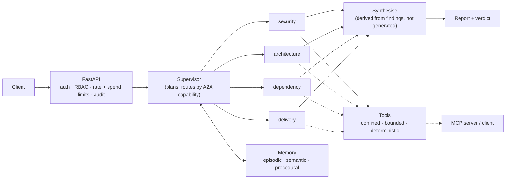
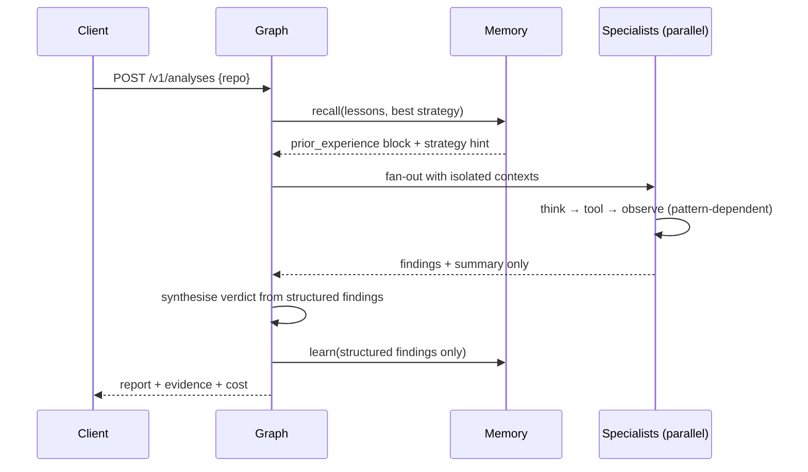

# Atlas

**An evaluation-driven multi-agent platform for technical due diligence.** Four specialist agents analyse a repository in parallel — security, architecture, dependency risk, delivery maturity — and return an evidence-backed report. Built on LangGraph, MCP and A2A.

[]() []() []()

```
offline unit + regression suite · eval quality gate in CI · 4 reasoning patterns benchmarked · no model API key required
```

## Why this exists

LangChain's 2026 State of Agent Engineering survey found that ~89% of teams running agents in production have observability, but only ~52% have evals. **That 37-point gap is where agent quality dies** — observability tells you what happened, only evals tell you whether it was right.

Atlas is built the other way round: evaluation first, and everything else in service of it.

| Most agent projects | Atlas |
|---|---|
| "the agent found some issues" | precision/recall against **planted ground truth**, with traps for over-reporting |
| picked one pattern, moved on | four patterns implemented, and a harness that **measures what each costs** |
| "it has memory" | memory **A/B harness that reported a null result** and a retrieval bug, both published |
| prompt says "be careful" | tool confinement, ReDoS bounds, RBAC, spend brakes enforced in code and tested |
| demo runs on the happy path | failure isolation, compaction, timeouts, cost ceilings — each verified by measurement |

**One caveat up front, because it is the first thing a reviewer should know:**
the evaluation model is a deterministic scripted oracle. The pattern
differences below are *authored* in `src/atlas/evals/scenarios.py` to match
each pattern's documented behaviour, and the harness measures the
consequences. That makes this a working **measurement apparatus** plus
evidence I understand what each pattern costs — not a discovery about model
behaviour. Pointing it at a live model is one config change and has not been
done. Every claim in this README is scoped accordingly.

## Architecture



Specialists run **concurrently** and are **context-isolated**: each keeps its own message list and returns only findings plus a one-paragraph summary. The supervisor never sees a specialist's transcript. That asymmetry is what stops a four-agent run from carrying four full transcripts into every later step — the reason naive multi-agent systems cost more than a single agent while performing worse.



## Quick start

```bash
pip install -e ".[dev,mcp]"

make demo        # 5-act walkthrough: agents, traps, benchmark, memory, protocols
make test        # complete offline unit and regression suite
make evals       # ground-truth quality gate (what CI blocks merges on)
make benchmark   # regenerate benchmarks/RESULTS.md
make memory-ab   # regenerate docs/MEMORY.md

make run         # API at :8000   (set ATLAS_API_KEYS first — it denies by default)
make up          # docker compose, hardened container
```

Everything above runs **offline against a deterministic scripted model**. Point it at a real model with `ATLAS_PROVIDER=anthropic` and an API key.

### Run and use it locally

The simplest complete experience uses only Python and the scripted provider:

```bash
python3 -m venv .venv
source .venv/bin/activate
make install

RAW_KEY=local-atlas-key
KEY_HASH=$(python -c "from atlas.security import hash_key; print(hash_key('$RAW_KEY'))")
export ATLAS_API_KEYS="local:${KEY_HASH}:admin"
make run
```

In a second terminal:

```bash
RAW_KEY=local-atlas-key
curl -s http://127.0.0.1:8000/healthz

curl -s -X POST http://127.0.0.1:8000/v1/analyses \
  -H "Authorization: Bearer ${RAW_KEY}" \
  -H "Content-Type: application/json" \
  -d '{"repo":"legacy-billing","pattern":"react"}'

curl -s http://127.0.0.1:8000/metrics \
  -H "Authorization: Bearer ${RAW_KEY}"

curl -s http://127.0.0.1:8000/v1/audit \
  -H "Authorization: Bearer ${RAW_KEY}"
```

Use `Ctrl-C` to stop the API. The key above is deliberately local-only; never
reuse it in a deployed environment. For an isolated container instead, run
`make up` and authenticate with the documented local Compose key
`dev-analyst-key`. Add `--profile metrics` to the Compose command to start
Prometheus on `127.0.0.1:9090`; `make down` removes the stack and its local
containers while preserving the audit volume (`make clean` deletes it). If a
port is occupied, override it with `ATLAS_PORT=18000` or
`PROMETHEUS_PORT=19090`. The [runbook](docs/RUNBOOK.md) covers configuration, role
permissions, deployment validation, monitoring, incidents and rollback. The
[learning path](docs/LEARNING_PATH.md) explains the implementation in reading
order.

The shipped deployment is a **single-instance reference/CV deployment**, not
an enterprise platform. Memory, checkpointing, limits and the audit tail are
local to one process. PostgreSQL-backed durable checkpointing and memory,
Redis-backed distributed limits, generic OIDC/JWKS, tenant isolation, an
off-box WORM audit sink, managed secrets and multi-region HA are explicit
extension paths; none is implemented or implied by the current manifests.
See [Limitations](docs/LIMITATIONS.md) and the [runbook](docs/RUNBOOK.md).

## The measured results

**Harness validation across four patterns** (full table + caveats in [benchmarks/RESULTS.md](benchmarks/RESULTS.md)):

| pattern | F1 | precision | recall | traps | model calls | cost |
|---|---|---|---|---|---|---|
| `reflexion` | 0.952 | 1.000 | 0.909 | **0** | 33 | $0.100 |
| `plan_execute` | 0.909 | 0.909 | 0.909 | 1 | 27 | $0.087 |
| `react` | 0.909 | 0.909 | 0.909 | 1 | 17 | $0.039 |
| `rewoo` | 0.737 | 0.875 | 0.636 | 1 | 16 | **$0.035** |

Read this as *"the harness has enough resolution to separate patterns and
price them"*, not *"reflexion is the best pattern"*. The behaviours are
scripted; what is real is the measurement — ground-truth scoring with
cardinality, trap detection, and per-pattern cost accounting. `react` reaches
the same F1 as `plan_execute` for **less than half the model calls**, which
is the kind of thing a benchmark exists to surface.

**Memory** ([docs/MEMORY.md](docs/MEMORY.md)) — two findings, both published:

1. Cross-repository transfer measured **no effect**. The first version of that
   harness pre-trained on the very repositories it then scored and produced a
   comfortable positive number. It was a leak, it was found in review, and the
   corrected experiment returns a null.
2. Semantic retrieval was **returning zero records on every production run**.
   Lessons were written as `"security: 'sql_injection' appeared here…"` while
   the graph queried `"technical due diligence for repository X"` — almost no
   lexical overlap, so everything fell below the relevance floor. The unit
   tests missed it because they queried with lesson-shaped text. Fixed with
   hybrid retrieval (metadata filter, then vector rank), which is what
   production vector stores do.

## What's actually hard here

**1. Ground truth makes evaluation real.** `fixtures/repos/` contains two repositories with *deliberately planted* issues and an answer key in `evals/golden/ground_truth.yaml`. Because the answer is known, Atlas reports precision and recall rather than vibes. The clean repo also contains **traps** — code that pattern-matches as vulnerable but is correct — so an agent that reports everything is caught rather than rewarded.

**2. Micro vs macro averaging.** The fixture set is imbalanced by design (11 planted issues vs 0). Macro-averaging F1 gives the empty control repo equal weight and lets one false positive halve the headline number; the control also makes precision/recall degenerate (0/0). Both averages are computed and the reasoning is in the code.

**3. Context compaction that doesn't corrupt the conversation.** Naive truncation orphans `ToolMessage`s whose originating tool call was dropped, which most providers reject outright. Compaction here expands cut points backwards to a safe boundary, summarises the dropped middle (preserving *which tools were already tried*), and truncates individual monster messages rather than letting one tool result evict the history.

**4. Hybrid retrieval, learned the hard way.** Lessons derive only from structured `Finding` objects carrying evidence — never model prose. Retrieval filters on metadata (`category`) *then* ranks by similarity with recency decay, because pure vector search silently returned nothing for the query the system actually issued while its unit tests passed. Procedural memory is Laplace-smoothed, because a strategy that won 1/1 must not outrank one that won 47/50.

**5. Protocols on both sides.** Atlas is an MCP **server** (exposing its toolkit) and an MCP **client** (consuming others'). Remote tool descriptions are untrusted input destined for a prompt, so they are allowlisted deny-by-default, sanitised for injection-shaped text, and namespaced `server::tool` so they cannot shadow local tools. `FederatedToolkit` puts remote tools on the *agent's* tool path — `run_due_diligence(..., remote_tools=(proxy,))` — bounded by per-call timeouts, with remote failures degraded into `ERROR:` observations rather than exceptions, because a remote server going down must not end an analysis the local toolkit can finish. A2A agent cards drive supervisor routing by *capability*, so adding a specialist never edits the orchestrator.

> That wiring is new, and it is the fix for a defect worth naming: the MCP client was fully implemented and fully tested, and no agent could reach it. `grep -r mcp_layer.client src/` found it imported by one helper, the demo, and the test suite — never by the graph. The README made the claim anyway. A capability no agent can reach is a capability the system does not have.

**6. Brakes that were measured, not assumed.** Three runtime controls were verified to be *decorative* before they were fixed, and each fix is measured: the specialist timeout joined the worker it gave up on (20s hang, 2s timeout, 20s wall — now 2.03s); the run cost ceiling read `0.0` in every parallel branch so it could never fire (now enforced before each model call — `$0.01` ceiling halts a `$0.027` run at 3 findings); the spend reservation was a hardcoded $0.25 against a $5.00 per-run ceiling. Plus: hashed keys with constant-time comparison and deny-by-default, RBAC where *spending money* is privileged, hash-chained audit with truncation detection, CSP/HSTS on **every** path including errors, pure-ASGI body limits, secret redaction at the logging boundary, non-root read-only container, egress NetworkPolicy blocking the cloud metadata endpoint.

## What an adversarial review found (and what happened next)

This repository was reviewed line-by-line by an independent reviewer briefed
to be hostile, then re-reviewed after the fixes. Between the two passes it
found **nine defects in the code and six more introduced by the fixes** —
including a spend-reservation leak that let 404 probes exhaust a principal's
daily budget without spending anything. All are fixed, each with a regression
test that names the bug in `tests/test_regressions.py`:

| Severity | Defect | Consequence |
|---|---|---|
| Critical | Path confinement used `str.startswith`, not path ancestry | A sibling directory with a shared name prefix escaped the sandbox — demonstrated live |
| Critical | `lstrip("./")` strips a character set, not a prefix | Repo-root ground truth could never match; scored as a miss *and* a false positive. Fixing it moved F1 0.783 → 0.870 |
| Critical | Memory A/B pre-trained on the repositories it scored | The published "+0.026 memory helps" was produced by a leaked experiment |
| Critical | `/v1/analyses/stream` awaited the whole run before emitting | Every SSE event arrived at the same instant; the test asserted order only, so it passed |
| Critical | The graph recalled from memory but never wrote to it | The hub stayed empty forever; "the agent improves" was decoration |
| Critical | `parents[3]` path discovery | Every analysis 404'd inside the container; CI only checked the uid |
| Major | Check-then-spend on the budget | TOCTOU race: N concurrent requests overshoot by N × projection |
| Major | Histograms retained every raw sample | Unbounded memory growth and O(n log n) scrapes |

| Major | "Position bias control" compared two different reports instead of swapping order | Returned agreement unconditionally — it could not fail |

The second review pass then caught six regressions *from those fixes*, the
worst being a spend reservation taken before request validation: six 404s at
$0.25 projected each exhausted a $1 budget having spent nothing. Reservations
are now taken after validation and released in a `finally`.

### Round 3: a genuinely blind review

The first two reviews were primed — I described the code, then asked for
bugs in it. A third reviewer was given the repository and nothing else, and
found ten blocking issues the primed reviews had missed entirely. The lesson
is about review process, not just about code:

| Severity | Defect | Consequence |
|---|---|---|
| Critical | Specialist timeout used `with ThreadPoolExecutor(...)`, whose `__exit__` joins | 20s hang + 2s timeout = 20s wall, then reported "exceeded 2.0s" |
| Critical | Run cost ceiling read `state["cost_usd"]` at fan-out | All four branches read `0.0`; the brake could never fire |
| Critical | Spend projection was $0.25 against a $5.00 per-run ceiling | Four pre-authorised runs could spend 20x a $1 daily cap |
| Critical | `grep`/`list_files` walked and read directly, bypassing `_resolve` | A symlink inside the repo exposed any file on disk |
| Critical | Model-supplied regex had no complexity or time bound | `(a+)+$` spun indefinitely on a 60-char line |
| Critical | Semantic retrieval returned zero records for the production query | The entire vector tier was dead at runtime while unit tests passed |
| Critical | Benchmark narrated authored fixture behaviour as a measured discovery | The single easiest claim in the repo to falsify |
| Critical | Demo ACT 4 printed a memory block that was never injected | Caption said "injected into the next run's prompt"; it wasn't |
| Major | Ground truth had no cardinality | Two real SQLi sinks: the second scored as a hallucination, and *suppressing* it raised precision |
| Major | Reservations taken before request validation | Six 404 probes exhausted a $1 budget having spent nothing |

Plus: MCP allowlist allowed everything by default while its docstring
claimed the opposite; security headers were absent on every error path; and
several regression tests could not fail (one grepped its own source).

### Round 4: a second blind review, on the fixed code

The obvious next question is whether a blind review finds anything once the
first one has been acted on. It does, and the findings were worse:

| Severity | Defect | Why it mattered |
|---|---|---|
| Blocking | **`bind_tools()` was never called.** Anywhere. | No model was ever told which tools existed. Invisible under the scripted model, whose tool calls are authored into the fixture — so 134 tests, a demo and an eval gate all passed over a dead tool loop. Against a real provider `tool_calls` is empty on every call, and the confinement work, the compaction machinery and the ReWOO planner are all unreachable. |
| Blocking | ReDoS guard ignored `{n,m}` | `(a+)+$` was caught; `(a{2,}){2,}$` — the same pattern in the other notation — still spun past 40s against a 2s deadline. Plus three more bypasses. |
| Blocking | The test guarding it exercised nothing | Its payload was rejected by the static guard in microseconds, so a 5-second bound was asserted against an error path. It passed against an implementation with no deadline at all. |
| Blocking | Rate limiting skipped for every invalid request | The Round-2 fix moved *all* of `enforce_limits` behind repo resolution, taking the request bucket with it. 50 unknown-repo POSTs against a bucket sized for 1: fifty 404s, zero 429s. |
| Blocking | Streaming route crashed instead of returning 429 | The reservation ran inside the generator, after `http.response.start` had been sent — so the HTTPException could not become a response. Non-stream: 429. Stream: `RuntimeError`, truncated 200, no `Retry-After`. |
| Blocking | Cost ledger keyed by repository name | The comment claimed "run-scoped, keyed by thread_id". Two concurrent analyses of one repo shared a ceiling, and either one's cleanup erased the other's four in-flight subtotals. |
| Blocking | `FederatedToolkit.specs()` was called by tests and the demo, never by `src/` | The same defect the round-3 fix was celebrating, one level up. The demo printed remote tool names under the caption "reached the agent". |
| Should-fix | Memory floor and decay disabled on the filtered path | `floor = 0.0 if filtered else min_score`, and the graph always filters. Both guarding tests called `search()` without `where` — testing the branch production never takes, which is *verbatim* the failure documented in `docs/MEMORY.md`. |
| Should-fix | Two of five declared traps could never fire | `tests/` never matched `tests/test_repository.py`. `max_traps: 1` is the gate and the baseline sits exactly at 1. |
| Should-fix | `read_file` capped output, not input | `max_lines=100_000_000` allocated 665MB to return 8KB. `grep` still called `read_text()` on whole files. |
| Should-fix | `ATLAS_DAILY_SPEND_USD` did not exist | The startup error told operators to raise a variable that appeared nowhere but in that error string. |
| Should-fix | Position-bias control returned *disagreement* on every tie | A positional `a >= b` tie-break, in a comparator that declares itself provably order-insensitive. Ties are the common case for a 4-criterion integer average. |
| Nit | `steps` recorded the finding count | Stored in `total_steps`, averaged into `avg_steps`. Plausible on a dashboard, about something else entirely. |
| Nit | `_context_key` bucketed on `len(repo_name) > 24` | Procedural memory's entire context dimension was a proxy for how long someone typed the directory name. |

The reason these tables are in the README rather than quietly fixed:
shipping software is not the absence of defects, it's the presence of a
process that finds them. Round 3 showed that *unprimed* review finds what
primed review cannot. Round 4 showed something sharper — that fixing a
defect class does not immunise you against it. The MCP-client finding, the
memory-test finding and the ReDoS-guard finding are each the *same mistake
recurring inside its own fix*, which is the most useful thing on this page.
Every entry here is a question I can answer in depth.

## Repository map

```
src/atlas/
├── domain/         findings, evidence, reports (evidence is mandatory)
├── llm/            model protocol + deterministic scripted model
├── context/        token budgets, compaction
├── memory/         4 tiers + A/B measurement harness
├── tools/          confined, bounded, deterministic repo analysis
├── mcp_layer/      MCP server + trust-aware MCP client
├── a2a/            agent cards, capability routing
├── agents/         prompts (incl. injection guard) + output parsing
├── patterns/       react · plan_execute · reflexion · rewoo
├── graph/          LangGraph orchestration, reducers, isolation
├── evals/          ground truth scoring, judges, tiered gates
├── security/       auth, RBAC, rate/spend limits, audit, middleware
├── observability/  structured logs w/ redaction, OTel, Prometheus
└── api/            FastAPI + SSE streaming
fixtures/repos/     two repos with planted ground truth
evals/golden/       the answer key
benchmarks/         pattern comparison + memory A/B
docs/               architecture, ADRs, learning path, runbook, limitations
```

## Documentation

| Doc | Covers |
|---|---|
| [docs/LEARNING_PATH.md](docs/LEARNING_PATH.md) | **Start here** — the 7-phase curriculum this repo teaches, in order |
| [docs/architecture.md](docs/architecture.md) | Components, invariants, data flow |
| [docs/adr/](docs/adr/) | 8 decision records with alternatives and consequences |
| [docs/EVALS.md](docs/EVALS.md) | Evaluation methodology and the three CI tiers |
| [docs/MEMORY.md](docs/MEMORY.md) | Memory design + measured A/B result |
| [docs/SECURITY_MODEL.md](docs/SECURITY_MODEL.md) | Threat model and control mapping |
| [docs/FAILURE_MODES.md](docs/FAILURE_MODES.md) | What breaks and what happens |
| [docs/RUNBOOK.md](docs/RUNBOOK.md) | Deploy, monitor, respond |
| [docs/LIMITATIONS.md](docs/LIMITATIONS.md) | What this doesn't do, and the upgrade path for each |
| [docs/INTERVIEW_STUDY_GUIDE.md](docs/INTERVIEW_STUDY_GUIDE.md) | How to defend every decision here |
| [AGENTS.md](AGENTS.md) | Binding standards for AI agents working on this repo |

## License

MIT
