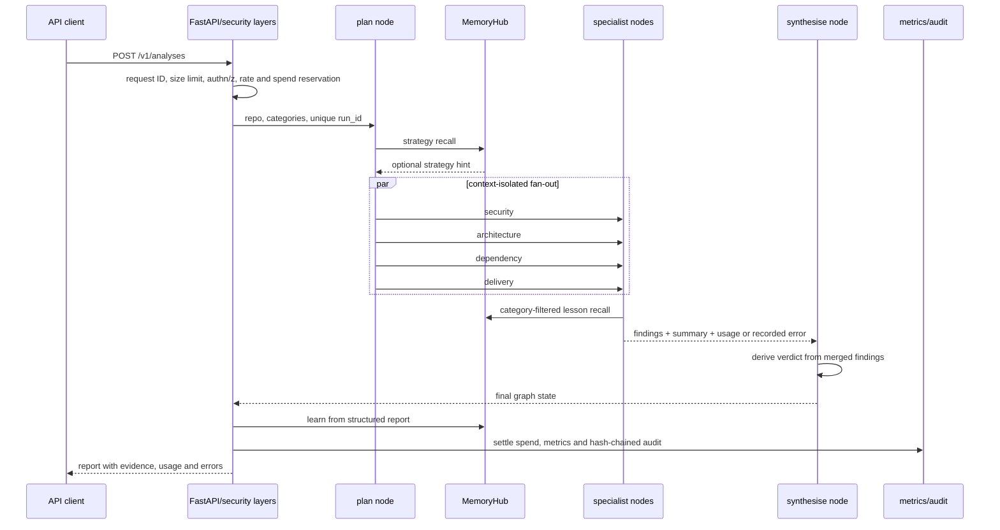
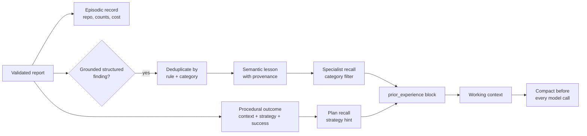
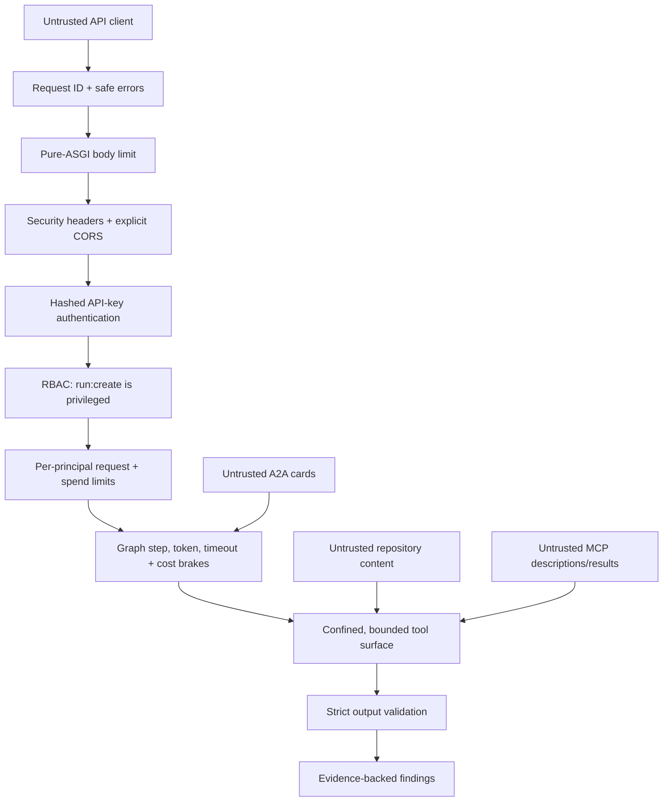

# AI system design

Atlas is an evaluation-driven, multi-agent reference system for technical due
diligence. Four domain specialists inspect a fixture repository in parallel,
return evidence-backed findings, and feed a deterministic synthesis step. The
system is deliberately designed so that claims about quality, cost, memory and
failure handling can be reproduced offline rather than inferred from a demo.

This document is the evidence map for that design. It distinguishes implemented
capabilities from extension points and links each material claim to source,
tests, or a generated measurement. The [documentation map](README.md) assigns
canonical ownership and indexes all eight ADRs.

## Goals, boundaries and trade-offs

Atlas optimises for five properties:

1. **Falsifiable output.** A `Finding` is useful only when it points to
   `Evidence`; grounded output enables deterministic scoring and human review
   ([domain types](../src/atlas/domain/types.py),
   [output parsing tests](../tests/test_graph_and_patterns.py)).
2. **Context isolation with parallel coverage.** Specialists run concurrently,
   but their transcripts remain local to their graph nodes. Only structured
   findings, summaries and accounting cross the fan-in boundary
   ([graph implementation](../src/atlas/graph/build.py),
   [reducers](../src/atlas/graph/state.py),
   [ADR-0003](adr/0003-context-isolation.md)).
3. **Derived decisions.** The verdict is computed from validated findings, not
   generated by another model, so synthesis cannot introduce an unreported
   severity ([synthesis node](../src/atlas/graph/build.py),
   [ADR-0008](adr/0008-verdict-is-derived.md)).
4. **Executable quality and resource limits.** Ground-truth thresholds,
   context limits, step ceilings, pre-call cost brakes, timeouts, RBAC and
   rate/spend admission are code paths rather than prompt instructions
   ([eval runner](../src/atlas/evals/runner.py),
   [pattern runtime](../src/atlas/patterns/base.py),
   [API](../src/atlas/api/app.py)).
5. **Offline reproducibility.** The scripted model, deterministic tools,
   feature-hashing embedder and rule-based judge make CI fast and stable
   ([scripted model](../src/atlas/llm/scripted.py),
   [embeddings](../src/atlas/memory/embeddings.py),
   [judge](../src/atlas/evals/judge.py)).

The main trade-off is scope. Current measurements validate the platform and
measurement apparatus, not live-model quality or deployed capacity. Atlas uses
two fixture repositories, an in-process checkpointer and memory stores, a
single-replica deployment, and no code-execution tool
([limitations](LIMITATIONS.md), [performance evidence](PERFORMANCE.md),
[evaluation methodology](EVALS.md)).

## Request and graph-state lifecycle



The API resolves the requested fixture before reserving spend, creates a
principal/request-specific LangGraph thread ID, and moves blocking graph work
to a worker thread ([API request path](../src/atlas/api/app.py)). Streaming uses
LangGraph `stream_mode="updates"` and drains node updates concurrently, so a
specialist event is emitted when that branch completes rather than after the
whole report exists. It captures the plan node's actual selected strategy and
assembles the complete structured report, including specialist summaries,
errors, tokens, model calls, cost and duration, before procedural learning. This keeps
streaming memory writes equivalent to the non-streaming path rather than
learning from the requested/default strategy or a partial report
([streaming implementation](../src/atlas/api/app.py),
[streaming regression test](../tests/test_security_and_api.py)).

### Shared state and merge semantics

`DDState` separates caller inputs, supervisor choices, specialist outputs,
accounting and synthesis. Its reducers encode the concurrency contract
([state definition](../src/atlas/graph/state.py)):

| State group | Merge rule | Reason |
|---|---|---|
| `findings`, `results` | list concatenation | preserve every parallel branch |
| `summaries`, `errors` | key-wise merge | isolate specialists while retaining attribution |
| `tokens_used`, `model_calls`, `cost_usd`, `steps` | addition | report whole-run usage |
| `plan`, `strategy`, `memory_block`, `verdict` | last write wins | each has a single logical writer |

Specialist transcripts are intentionally absent. A node constructs its own
messages, applies the selected pattern, and returns a `SpecialistResult`; the
four-way fan-in is regression-tested to ensure no reducer silently drops a
branch ([graph tests](../tests/test_graph_and_patterns.py)).

The run-cost brake cannot rely on graph state because every branch sees the
pre-fan-out value. Atlas therefore uses a locked, run-ID-scoped ledger that is
consulted immediately before each model call. Each helper execution creates a
unique ID, admits it before invoking the graph and retires it in `finally`.
Direct compiled-graph invocation with a missing, unknown or retired ID fails
in the plan node before any model call. Retired-ID tombstones are bounded by
TTL and capacity for diagnostics; active admission is authoritative, so
expiry or eviction cannot re-admit late work. A call already admitted may
take the total beyond the configured maximum, so this is a brake with
bounded-by-call overshoot, not an atomic hard ceiling
([run ledger](../src/atlas/graph/build.py),
[runtime-brake tests](../tests/test_runtime_brakes.py)).

### Persistence, recovery and failure semantics

Every compiled graph has a LangGraph `InMemorySaver`. It supports per-node
updates and inspection during a live process, but each normal build owns a
fresh saver. Checkpoints therefore do **not** survive process restart and Atlas
does not claim durable run recovery
([graph builder](../src/atlas/graph/build.py),
[cache isolation tests](../tests/test_graph_cache.py)).

A caller may supply a checkpointer, which deliberately bypasses the compiled
graph cache so state cannot leak between runs. The production extension is a
durable PostgreSQL checkpointer with explicit migration, restore and tenant
isolation tests—not a replica-count change
([architecture scaling notes](architecture.md),
[deployment limitations](LIMITATIONS.md)).

Within a live run, model/tool errors become results or observations, and a
failed specialist records an attributed error while other branches continue.
The derived verdict names partial failure
([pattern runtime](../src/atlas/patterns/base.py),
[graph failure isolation](../src/atlas/graph/build.py),
[failure modes](FAILURE_MODES.md)).

## Memory taxonomy and lifecycle

Atlas implements four actual tiers rather than using “memory” as a synonym for
a vector store ([tier implementation](../src/atlas/memory/tiers.py),
[ADR-0005](adr/0005-memory-tiers.md)):

| Tier | Contents | Lifetime/retention | Read path |
|---|---|---|---|
| Working | current specialist message window | one specialist step; compacted before model calls | recent window plus deterministic digest |
| Episodic | one structured record per completed run | in-process, append-only, queryable by repo/recency | operator/API history |
| Semantic | deduplicated lessons derived from grounded finding classes | in-process; capacity 500; oldest logical run evicted | metadata filter, vector rank, recency decay, relevance/freshness floor, top-k |
| Procedural | strategy success, cost and model-call totals per repository-size context | in-process; explicit JSONL import/export helpers exist but are not wired into the service | Laplace-smoothed best strategy |



### Writes, retrieval and isolation

`MemoryHub` is the only agent-facing seam. On successful run completion it
writes an episode, one semantic lesson per `(rule, category)`, and a procedural
outcome. It rejects ungrounded findings and never memorises free-form model
prose ([hub write path](../src/atlas/memory/hub.py),
[memory tests](../tests/test_memory.py)).

Plan-level recall chooses a strategy. Semantic lessons are recalled inside each
specialist with a category filter, so one specialist does not receive another
domain's lessons ([graph recall path](../src/atlas/graph/build.py)). Semantic
ranking combines deterministic feature-hash cosine similarity with exponential
recency decay. Unfiltered retrieval uses a relevance floor; filtered retrieval
adds a category-match prior but still applies decay and a non-zero floor so
stale records eventually disappear from results. Retrieval is capped by
`memory_top_k`, default 3
([semantic search](../src/atlas/memory/tiers.py),
[memory configuration](../src/atlas/config.py)).

Procedural selection uses a repository-size context key and Laplace-smoothed
success rate, preventing one lucky success from permanently outranking a
well-tested strategy ([context key](../src/atlas/graph/build.py),
[strategy statistics](../src/atlas/memory/tiers.py)).

### Compaction and retention

Working memory is governed by `TokenBudget` and `compact_messages`. Before every
model call, Atlas preserves the system prompt and recent window, keeps tool
request/result pairs intact, replaces older turns with an extractive digest
that records tools already used, and truncates oversized individual messages
([budget](../src/atlas/context/budget.py),
[compaction](../src/atlas/context/compaction.py),
[compaction tests](../tests/test_context.py)).

Semantic capacity eviction is deterministic oldest-by-logical-run. Recency
decay happens at retrieval instead of deleting knowledge at write time.
Episodic and procedural stores have no automatic retention limit today, and
all service memory is lost on restart. Durable, tenant-scoped PostgreSQL and
pgvector stores remain future work ([memory limitations](LIMITATIONS.md)).

### Measured memory evidence and failure analysis

The committed A/B report is generated by `make memory-ab`
([harness](../benchmarks/memory_ab.py),
[results and caveats](MEMORY.md)):

- Cross-repository transfer: `+0.000` quality and `+$0.0045` cost—no
  significant effect on the two-repository fixture set.
- Same-repository re-analysis: `+0.048` quality in one deterministic,
  memory-sensitive scripted run. This proves the harness can detect an effect;
  it is not evidence that a live model improves.

The harness scores each repository before learning from it and skips overlap
between warmup and scored sets to prevent leakage
([A/B implementation](../src/atlas/memory/measure.py)). A production-path
failure also shaped the design: generic plan queries had almost no lexical
overlap with stored lessons, so pure vector retrieval returned zero records
while lesson-shaped unit tests passed. Category-filtered specialist retrieval
fixed that path, and stale filtered records now have regression coverage
([failure analysis](MEMORY.md), [filtered retrieval test](../tests/test_memory.py)).

## Evaluation methodology and evidence

Atlas separates three sources of truth
([methodology](EVALS.md)):

| Layer | Question | Implementation |
|---|---|---|
| Planted ground truth | Did the report find known issues without triggering decoys? | [answer key](../evals/golden/ground_truth.yaml), [scorer](../src/atlas/evals/scoring.py) |
| Deterministic validation | Do citations resolve? Is severity distribution useful? Is remediation actionable? | [rule-based judge](../src/atlas/evals/judge.py) |
| Scripted behaviour | Can graph/pattern/eval machinery reproduce known trade-offs offline? | [scenarios](../src/atlas/evals/scenarios.py), [scripted model](../src/atlas/llm/scripted.py) |

The fixture set contains one deliberately unsafe service with 11 planted issue
rules, one of which permits two distinct instances, and one healthy control with
five false-positive traps
([fixtures](../fixtures/repos),
[ground truth](../evals/golden/ground_truth.yaml)). Matching requires a
normalised exact rule, boundary-aware path match, minimum severity and declared
cardinality. Headline precision, recall and F1 are micro-averaged because the
fixture set is intentionally imbalanced; macro F1 is still reported
([scoring rules](../src/atlas/evals/scoring.py)).

The standard gate enforces:

| Metric | Threshold |
|---|---:|
| F1 | `>= 0.80` |
| Precision | `>= 0.75` |
| Recall | `>= 0.80` |
| Traps | `<= 1` |
| Hallucination rate | `<= 0.05` |
| Judge prioritisation, reports with findings | `>= 4.0` |
| Judge actionability, reports with findings | `>= 4.0` |

Thresholds live beside the runner in `GATES`
([executable gate](../src/atlas/evals/runner.py)). The current committed
standard snapshot is [evals/last_run.md](../evals/last_run.md); CI regenerates
it, rejects drift, and uploads it as `eval-report`
([CI workflow](../.github/workflows/ci.yml)). Smoke and standard run on pull
requests. Extended adds one smoke pass per pattern but is currently manual, not
scheduled ([gate entry point](../evals/gate.py)).

The pattern comparison is a generated artifact, not a live-model leaderboard
([benchmark](../benchmarks/RESULTS.md)). Its current scripted results span F1
`0.737` to `0.952`, 16 to 33 model calls, and `$0.0349` to `$0.1002`. Those
numbers show that the harness resolves authored pattern trade-offs and meters
their cost. They do not establish which pattern is best for a real model.

## Layered guardrails and trust boundaries



The outer API layers enforce deny-by-default authentication, cumulative RBAC,
request-rate tokens, spend admission reservations, body limits, security
headers and explicit CORS. Privileged actions are written to a hash-chained,
redacted audit log; partial completions record the failed specialist categories
([API wiring](../src/atlas/api/app.py),
[auth](../src/atlas/security/auth.py),
[rate/spend limiter](../src/atlas/security/ratelimit.py),
[audit log](../src/atlas/security/audit.py),
[middleware](../src/atlas/security/middleware.py)).

Inside the graph, every model call is constrained by context, step, wall-clock
and run-cost budgets. Repository tools confine resolved paths to the configured
root, cap input/output, bound regex execution, expose no shell/exec capability,
and turn tool failures into observations
([repository toolkit](../src/atlas/tools/repo.py),
[pattern runtime](../src/atlas/patterns/base.py),
[runtime tests](../tests/test_runtime_brakes.py)).

Remote MCP descriptions are untrusted: discovery is not permission. Atlas
allowlists tools, sanitises descriptions, namespaces names to prevent local
tool shadowing, caps results, and degrades remote failures into observations
([MCP client](../src/atlas/mcp_layer/client.py),
[federation](../src/atlas/mcp_layer/federation.py),
[protocol tests](../tests/test_tools_and_protocols.py)). A2A cards are likewise
validated before capability routing
([agent cards](../src/atlas/a2a/cards.py)).

Strict parsing drops incomplete findings rather than inventing defaults.
Evidence is subsequently checked against the repository by the deterministic
judge ([parser](../src/atlas/agents/parsing.py),
[judge](../src/atlas/evals/judge.py)). These controls contain prompt injection;
they do not solve content influence. The full residual-risk analysis is in
[SECURITY_MODEL.md](SECURITY_MODEL.md) and the response procedure is in the
[runbook](RUNBOOK.md).

## Observability

Atlas exposes three complementary signal types:

| Signal | Implemented evidence | What it answers |
|---|---|---|
| Structured JSON logs | [logging boundary](../src/atlas/observability/logging.py) | plan choice, memory-use flag, failures and request context, with automatic secret redaction |
| OpenTelemetry spans | [tracing](../src/atlas/observability/tracing.py), [graph spans](../src/atlas/graph/build.py), [model/tool spans](../src/atlas/patterns/base.py) | causal timing across plan, parallel specialists, synthesis, model and tool calls |
| Prometheus metrics | [metrics](../src/atlas/observability/metrics.py), authenticated [endpoint](../src/atlas/api/app.py) | runs, findings, specialist outcomes/duration, tokens, model cost, partial runs, auth/rate limiting and graph-cache hits/misses |
| Tamper-evident audit | [audit](../src/atlas/security/audit.py), admin [endpoint](../src/atlas/api/app.py) | actor/action/resource/outcome/cost history and chain integrity |

Metrics use only bounded labels such as category, pattern and outcome;
repository names are deliberately excluded to prevent unbounded cardinality.
Histograms retain bucket counts rather than raw samples
([metrics implementation](../src/atlas/observability/metrics.py)).

Token and cost signals are read from model response metadata, accumulated
through graph reducers, returned in reports, and exported as counters
([meter](../src/atlas/patterns/base.py),
[state](../src/atlas/graph/state.py),
[metrics](../src/atlas/observability/metrics.py)). The scripted provider
supplies priced cost metadata; the current Anthropic adapter does not, so live
cost counters and monetary controls are unsupported on that path
([limitation](LIMITATIONS.md#security)). Compaction returns
before/after token estimates and dropped/truncated counts for callers and
tests, but these are not currently exported as dedicated Prometheus metrics
([compaction result](../src/atlas/context/compaction.py)). Retrieval exposes an
auditable `RecallResult` and logs a plan-level `memory_used` flag, but there is
no retrieval hit-rate/latency metric; that remains an observability gap rather
than an implied feature ([memory hub](../src/atlas/memory/hub.py),
[limitations](#limitations-and-next-steps)).

Tracing is optional: without the OpenTelemetry extra or an OTLP endpoint, the
span context manager is a no-op. `/metrics` requires `run:read` because it
exposes usage and spend. Alert examples and operational interpretation are in
the [runbook](RUNBOOK.md).

## Performance architecture and measured evidence

Atlas attacks controllable platform overhead while keeping provider latency out
of its CI gate:

- LangGraph fans out all selected specialists and merges them through explicit
  reducers ([graph topology](../src/atlas/graph/build.py)).
- API graph execution and streaming producers run off the event loop
  ([API concurrency](../src/atlas/api/app.py)).
- Real provider clients use a bounded eight-entry identity LRU; each cached
  entry retains its `Settings` object so identity cannot be recycled while the
  entry is live. Stateful scripted models remain per-run to avoid turn-sequence
  corruption ([provider cache](../src/atlas/api/app.py)).
- Compiled graphs are cached by model/settings/memory/registry/category
  identity in a locked, bounded eight-entry cache. Compilation happens outside
  the lock; caller-supplied checkpointers bypass caching
  ([graph cache](../src/atlas/graph/build.py),
  [cache correctness tests](../tests/test_graph_cache.py)).
- Context, model-step, pre-call run-cost, specialist-timeout, request-rate and
  spend-admission budgets bound different failure modes in the scripted path
  ([configuration](../src/atlas/config.py),
  [runtime brakes](../tests/test_runtime_brakes.py)).

The provider-client LRU and compiled-graph cache are separate bounds. A reused
provider object is eligible for graph-cache reuse, but provider construction
and connection-pool savings were not isolated. Profiling measured graph
compilation at 9.9 ms of a 38.4 ms run. Reusing the model/compiled graph reduced
median run time from 36.2 ms to 17.7 ms, a measured 18.5 ms (51%) saving.
Scripted eval/demo runs create a model per run and therefore recorded a 0/6
graph-cache hit rate. Tool-result caching was not added because measurement
found 29 calls and zero redundant calls across the compared repo/pattern runs
([performance analysis](PERFORMANCE.md)).

The committed latency baseline drives the ASGI app in-process with a scripted
model at six concurrent clients by 12 iterations. Current measured p95 values
are 12.6 ms (`healthz`), 35.4 ms (`metrics`), 404.4 ms (`analyse`) and 41.2 ms
(`analyse_404`), all below executable p95/p99 budgets
([baseline](PERFORMANCE.md), [benchmark code](../perf/benchmark.py),
[CI performance job](../.github/workflows/ci.yml)). This isolates routing,
validation, graph execution and serialisation. It is not throughput, real
network/TLS latency, live-provider latency or a capacity plan; Locust is
provided for a deployed environment
([load harness](../perf/locustfile.py)).

## One-command local showcase

After `make install`, run:

```bash
make demo
```

The command is offline and requires no API key, network service or database.
It executes the existing deterministic paths rather than a presentation-only
facsimile ([Make target](../Makefile), [demo source](../scripts/demo.py)).
Expected output is a five-act walkthrough:

1. four specialists analyse the unsafe fixture and print evidence locations,
   usage and a derived verdict;
2. ReAct and Reflexion are compared on the clean trap repository;
3. all four patterns are scored for F1, precision, recall, traps and cost;
4. plan-level and category-filtered memory retrieval are shown side by side;
5. MCP exposure/federation and A2A capability routing are demonstrated offline.

For the exact executable quality gate use `make evals`; for platform latency
budgets use `make perf`; and for every deterministic local gate use `make gate`
([Makefile](../Makefile)). Generated evidence is kept in the canonical
[eval snapshot](../evals/last_run.md), [pattern benchmark](../benchmarks/RESULTS.md),
[memory A/B report](MEMORY.md), and [performance report](PERFORMANCE.md).

## Limitations and next steps

The most important unsupported or partial competency claims are explicit:

| Area | Current boundary | Evidence-based next step |
|---|---|---|
| Live-model quality | deterministic scripted scenarios; current runners instantiate `model_for(repo)` directly | build a provider-injected held-out runner, execute `N >= 10` repetitions and report distributions |
| Durable execution | per-build `InMemorySaver`; no restart resume | PostgreSQL checkpointer, idempotency and restart/restore tests |
| Durable/tenant memory | global in-process stores; semantic capacity only | tenant-keyed PostgreSQL/pgvector, retention policy, deletion and isolation tests |
| Distributed governance | one-process rate/spend ledgers | Redis-backed atomic limits and multi-replica concurrency tests |
| Identity/tenancy | static API keys and global state | OIDC/JWKS validation plus tenant boundaries across repositories, checkpoints, memory, metrics and audit |
| Audit durability | bounded memory tail and optional local JSONL | off-box WORM storage with independently anchored chain heads and restore drills |
| Arbitrary code analysis | no shell/exec tool and fixture-scoped repositories | external container/microVM sandbox before adding cloning or code execution |
| Capacity/availability | in-process benchmark and single replica | deployed load/soak tests, provider-inclusive SLOs, durable stores and failover |
| Retrieval observability | plan-level `memory_used` log only | bounded metrics for retrieval attempts/hits, filtered misses, latency and injected records |
| Compaction observability | structured `CompactionResult` but no exported metric | bounded counters/histograms for compactions, saved tokens and dropped messages |
| Live-provider cost controls | Anthropic usage is not normalised to priced `cost_usd` metadata | versioned provider-pricing adapter plus cached/input/output-token tests |

These are roadmap directions, not latent features. The detailed risk inventory
and upgrade ordering are maintained in [LIMITATIONS.md](LIMITATIONS.md), while
operational response and example reference-deployment objectives live in
[RUNBOOK.md](RUNBOOK.md).
